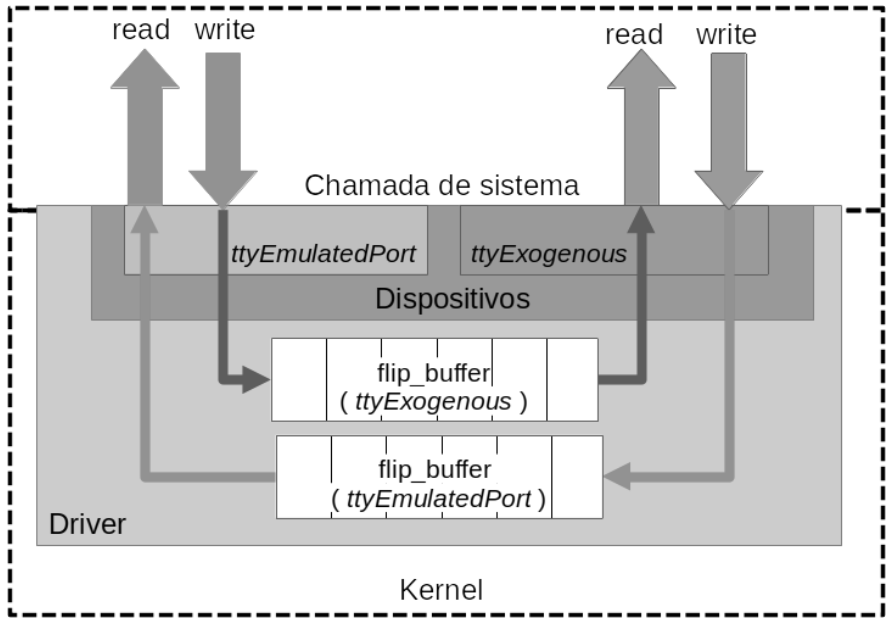
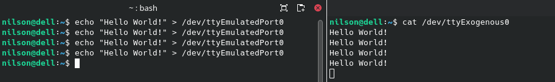

# SerialPortEmulator

||
|:-:|
|This is a serial port emulator. This is done by creating pairs of ports on ___/dev/___ where writing data on one port can be read on the pair and vice-versa.|


## Installation

1) Install the dependencies. On your Debian-like Linux machine, run:

```
sudo apt update
sudo apt install linux-headers-`uname -r` gcc binutils make
```

2) Inside the driver folder, run:

```
sudo -C /opt clone https://github.com/LabRedesCefetRJ/WeGIA.git
cd /opt/SerialPortEmulator/driver
sudo make clean all
sudo make modules_install
sudo make install
```

3) Set read and write permissions on the pairs of devices to be used

Example: for the EmulatedPort 0 device:

```
sudo chmod 777 /dev/ttyEmulatedPort0
sudo chmod 777 /dev/ttyExogenous0
```

## Uninstallation

Inside the 'driver' folder, run: 

```
cd /opt/SerialPortEmulator/driver
sudo make uninstall
```

## Use 

After the installation, by default, it will be instantiated on /dev many pairs of devices:

- /dev/ttyEmulatedPort0 <---> /dev/ttyExogenous0
- /dev/ttyEmulatedPort1 <---> /dev/ttyExogenous1
...

And so on. Writing on one device will make its content ready to be read on the other pair, and vice-versa.

You MUST at least open the other pair port to start sending data to it.

## Example
In a terminal window, execute the command below to put the emulated port waiting for incoming data

Open another terminal window and run the below command. On the first terminal Window. It should appear the message.



## Copyright
<a rel="license" href="http://creativecommons.org/licenses/by/4.0/"></a><br />It is licensed under a <a rel="license" href="http://creativecommons.org/licenses/by/4.0/">Creative Commons Attribution 4.0 International License</a>. The licensor cannot revoke these freedoms as long as you follow the license terms:

* __Attribution__ — You must give __appropriate credit__ like below:

FREITAS, Bruno Policarpo Toledo; LAZARIN, Nilson Mori; PANTOJA, Carlos Eduardo. Uma Proposta de Emulador de Portas Seriais para Sistemas Multiagentes Embarcados. In: WORKSHOP-SCHOOL ON AGENTS, ENVIRONMENTS, AND APPLICATIONS (WESAAC), 17. , 2023, Pelotas/RS. Anais [...]. Porto Alegre: Sociedade Brasileira de Computação, 2023 . p. 55-66. ISSN 2326-5434. URL: https://sol.sbc.org.br/index.php/wesaac/article/view/33437


<details>
<summary> Cite using Bibtex </summary>


```
@inproceedings{wesaac,
 author = {Bruno Freitas and Nilson Lazarin and Carlos Pantoja},
 title = {Uma Proposta de Emulador de Portas Seriais para Sistemas Multiagentes Embarcados},
 booktitle = {Proceedings of the 17th Workshop-School on Agents, Environments, and Applications},
 location = {Pelotas/RS},
 year = {2023},
 keywords = {},
 issn = {2326-5434},
 pages = {55--66},
 publisher = {SBC},
 address = {Porto Alegre, RS, Brasil},
 url = {https://sol.sbc.org.br/index.php/wesaac/article/view/33437}
}

```
</details>